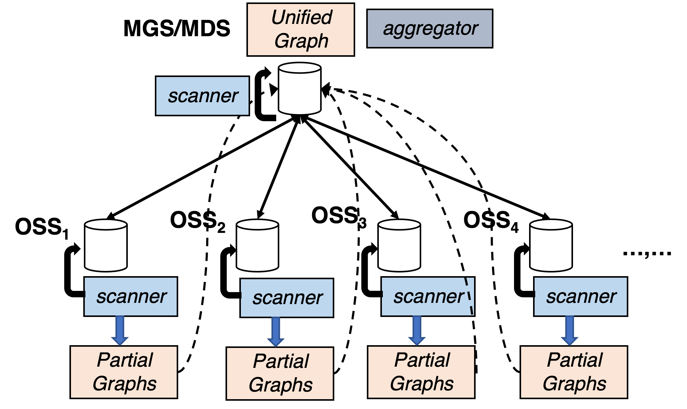

# Metadata Extraction

To validate the idea of FaultyRank in real-world large-scale settings, we implement this prototype of FaultyRank on Lustre. The following figure shows the key components of the FaultyRank system, where running the scanner is the first step of file system checking.

<figure>
  
  <figcaption>Figure: The architecture of FaultyRank prototype on Lustre.</figcaption>
</figure>

Lustre metadata is stored in two places:
1) The metadata like `FID`, `LINKEA`, and `LOVEA` are stored in the `Extended Attributes (EA)` of the local inodes.
2) The `DIRENT` metadata between the directory and its sub-directories or files are stored as the content of the directory file.

To extract Lustre metadata, we scan the extended attributes of inodes and the contents of directories of all `MDS` and `OSS` servers in our testbed. A partial graph is created on each server. This graph contains a list of edges, where each edge has a source vertex and destination vertex, each representing a Lustre directory, file, or stripe object. All the vertices have a unique global `FID`.

The user needs to run this scanner code on all MDS and OSS servers to extract the metadata from the local servers. Before running it, users must stop and unmount the Lustre file system, allowing the scanner to extract coherent metadata from disks.
